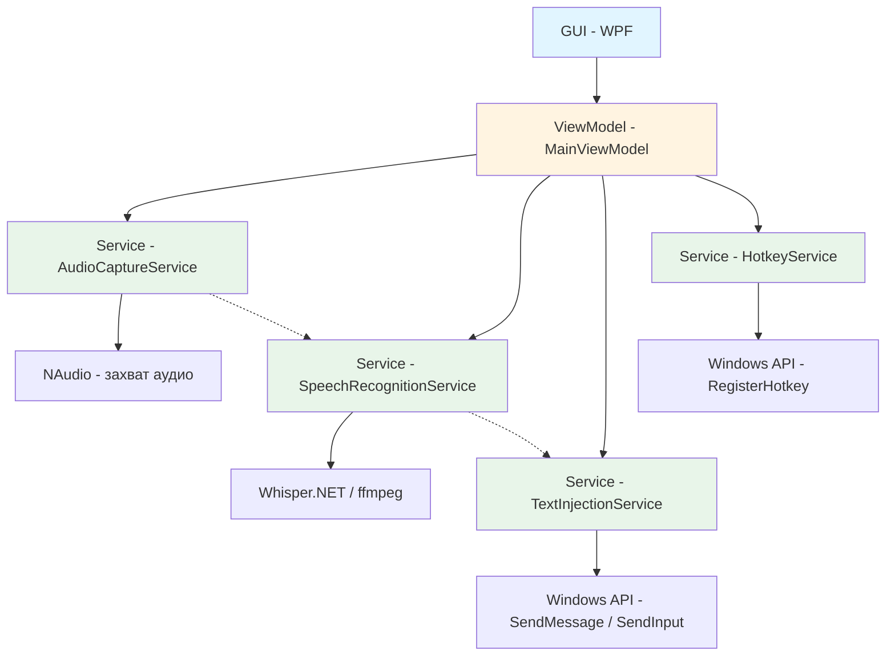
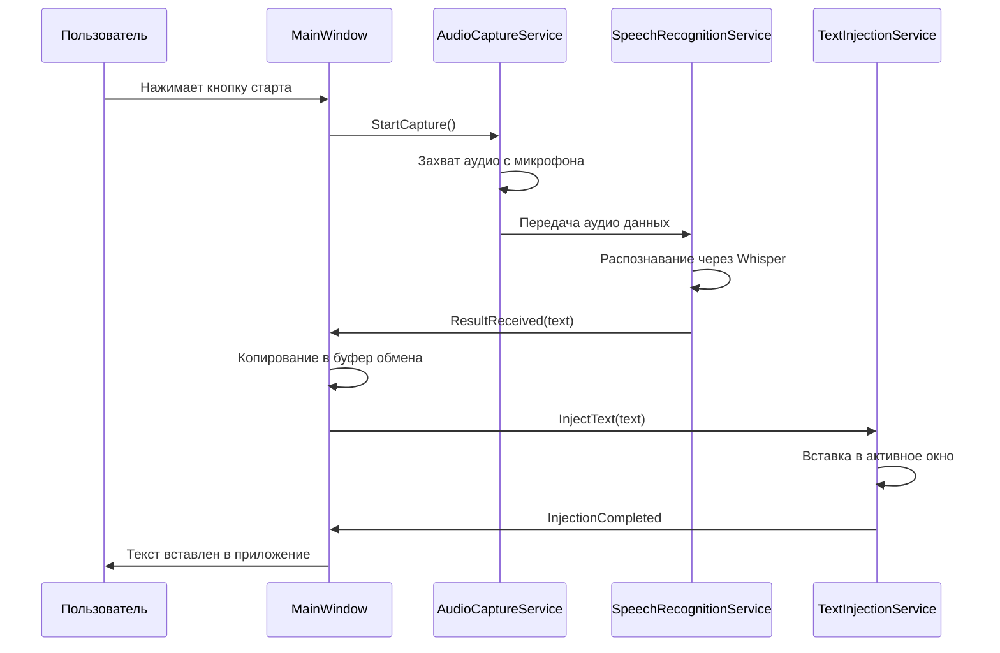

# План разработки приложения Speech-to-Text (STT)

## Обзор

Приложение для транскриции речи в текст с использованием локальной модели OpenAI Whisper. Программа работает в фоновом режиме, захватывает аудио с микрофона, распознаёт речь и вставляет результат в место фокуса текущего активного окна.

---

## Архитектура приложения



---

## Структура проекта

```
customSTT/
├── customSTT.sln
├── customSTT/
│   ├── customSTT.csproj
│   ├── App.xaml
│   ├── App.xaml.cs
│   ├── MainWindow.xaml
│   ├── MainWindow.xaml.cs
│   ├── ViewModels/
│   │   └── MainViewModel.cs
│   ├── Services/
│   │   ├── AudioCaptureService.cs
│   │   ├── SpeechRecognitionService.cs
│   │   ├── TextInjectionService.cs
│   │   ├── HotkeyService.cs
│   │   ├── TrayIconService.cs
│   │   └── TranscriptionHistoryService.cs
│   ├── Models/
│   │   ├── AppSettings.cs
│   │   └── TranscriptionEntry.cs
│   └── Converters/
│       └── BooleanToIconConverter.cs
├── whisper-models/
│   └── [модели Whisper загружаются сюда]
├── data/
│   └── history.json (история транскрипций)
├── plans/
│   └── speech-to-text-app-plan.md
└── rules.md
```

---

## Компоненты

### 1. GUI (MainWindow.xaml)

Основное окно приложения с элементами управления:

| Элемент | Описание |
|---------|----------|
| Статус-индикатор | Визуальное отображение состояния (готов, записывает, распознаёт) |
| Кнопка старта/стопа | Запуск и остановка захвата аудио |
| Поле текста | Отображение распознанного текста |
| Выбор модели | ComboBox с выбором модели Whisper (tiny, base, small, medium) |
| Выбор языка | ComboBox для выбора языка распознавания |
| Горячие клавиши | Отображение и настройка горячих клавиш |
| Чекбокс автозагрузки | Опция запуска при старте Windows |
| Чекбокс минимизации в трей | Свертывать в трей вместо закрытия |
| Выбор микрофона | ComboBox со списком доступных устройств + отображение текущего выбранного устройства (иконка: микрофон/веб-камера) |

### 1.1 OverlayService (оверлей с индикатором записи)

**Назначение:** Отображение визуального индикатора записи поверх всех окон.

**Технология:** Windows API (SetForegroundWindow / SetLayeredWindowAttributes) + NAudio для захвата VU-метра

**Функциональность:**
- Оверлей с пульсирующим индикатором при активной записи
- Показывает уровень звука в реальном времени (VU-метр)
- Цветовая индикация: зелёный (низкий уровень), жёлтый (средний), красный (высокий)
- **Оверлей всегда прозрачный** — сквозь него можно нажимать курсором и взаимодействовать с окнами под ним
- Возможность скрыть/показать оверлей через горячую клавишу или меню
- Оверлей отображается поверх всех окон с поддержкой прозрачности

**Алгоритм:**
1. Создание HWND для оверлея
2. Установка layered window attributes для полной прозрачности (alpha = 0)
3. Запуск отдельного потока для обновления VU-метра в реальном времени
4. Обработка горячих клавиш для скрытия/показа оверлея

### 1.1 Панель истории транскрипций

Всплывающая панель (Popup) со списком последних транскрипций:

| Элемент | Описание |
|---------|----------|
| Список записей | Последние N транскрипций (по умолчанию 20) |
| Временная метка | Время каждой транскрипции |
| Кнопка копирования | Копировать текст конкретной записи |
| Кнопка удаления | Удалить конкретную запись |
| Кнопка очистки | Очистить всю историю |
| Поиск | Фильтрация записей по тексту |

### 2. TrayIconService (иконка в системном трее)

### 2. AudioCaptureService (захват аудио)

**Назначение:** Захват аудио с микрофона пользователя.

**Технология:** [NAudio](https://github.com/naudio/NAudio)

**Функциональность:**
- Перечисление доступных аудиоустройств (встроенный + внешние микрофоны, веб-камеры с аудио)
- Выбор устройства ввода из выпадающего списка в GUI
- Сохранение выбранного устройства в настройках по умолчанию
- Захват аудио в реальном времени (PCM 16-bit, 16kHz, mono)
- Конвертация в формат, подходящий для Whisper
- Индикация уровня звука (VU-метр)

### 3. SpeechRecognitionService (распознавание речи)

**Назначение:** Передача захваченного аудио в модель Whisper и получение текста.

**Технология:** [Whisper.NET](https://github.com/lorentey/Whisper.NET) или прямое вызов `whisper.cpp` через Process

**Функциональность:**
- Загрузка модели Whisper (tiny, base, small, medium)
- Инициализация модели
- Распознавание речи из аудиофайла/потока
- Поддержка множественных языков
- Управление состоянием модели (загружена / не загружена)
- Кэширование модели для ускорения повторных вызовов

### 4. TextInjectionService (вставка текста)

**Назначение:** Вставка распознанного текста в место фокуса активного приложения.

**Технология:** Windows API (SendInput / SendMessage)

**Функциональность:**
- Получение активного окна фокуса
- Имитация нажатия Ctrl+V для вставки текста
- Обработка ошибок (если окно не принимает ввод)
- Поддержка буфера обмена

**Алгоритм:**
1. Скопировать текст в буфер обмена
2. Получить handle активного окна
3. Отправить последовательность клавиш (Ctrl+V) через SendInput
4. Очистить буфер обмена

### 5. HotkeyService (горячие клавиши)

**Назначение:** Управление глобальными горячими клавишами.

**Технология:** Windows API (RegisterHotkey / UnregisterHotkey)

**Функциональность:**
- Регистрация горячих клавиш (по умолчанию: Win+Shift+S или Ctrl+Alt+A)
- Перезапись горячих клавиш
- Отписка при закрытии приложения

### 6. AppSettings (настройки приложения)

**Назначение:** Сохранение и загрузка настроек.

**Формат:** JSON файл (`appsettings.json`)

**Параметры:**
```json
{
  "audioDevice": "Default",
  "language": "auto",
  "model": "base",
  "hotkey": "Ctrl+Alt+A",
  "autoStart": false,
  "minimizedToTray": true,
  "outputFormat": "plainText"
}
```

---

## Зависимости (NuGet пакеты)

| Пакет | Назначение |
|-------|-----------|
| CommunityToolkit.Mvvm | MVVM фреймворк (команды, INotifyPropertyChanged) |
| NAudio | Захват аудио |
| Whisper.NET | Обёртка для whisper.cpp |
| Newtonsoft.Json / System.Text.Json | Работа с JSON |
| HandyControl.WPF | Стили и компоненты WPF (опционально) |

---

## Поток данных



---

## Этапы реализации

### Этап 1: Настройка проекта
- Создание решения и проекта C# WPF
- Настройка NuGet зависимостей
- Базовая структура папок

### Этап 2: GUI
- Создание MainWindow.xaml
- Создание MainViewModel.cs
- Реализация статус-индикатора и кнопок
- Настройка стилей и иконок

### Этап 3: AudioCaptureService
- Интеграция NAudio
- Перечисление устройств
- Захват и запись аудио

### Этап 4: SpeechRecognitionService
- Интеграция Whisper.NET
- Загрузка моделей
- Распознавание речи

### Этап 5: TextInjectionService
- Работа с буфером обмена
- SendInput API
- Вставка в активное окно

### Этап 6: HotkeyService и настройки
- Глобальные горячие клавиши
- Сохранение/загрузка настроек
- Автозагрузка

### Этап 7: Финализация
- Тестирование всех компонентов
- Сборка и упаковка (MSI / NSIS / WinGet)
- Документация

---

## Потенциальные проблемы и решения

| Проблема | Решение |
|----------|---------|
| Whisper требует GPU | Поддержка CPU режима, рекомендация GPU для производительности |
| Размер модели (100MB-1GB) | Загрузка при первом запуске, выбор размера модели пользователем |
| Язык распознавания | Автоопределение или выбор пользователем |
| Конфликт горячих клавиш | Проверка при регистрации, предупреждение пользователя |
| Анимация вставки | Задержка перед вставкой для корректной передачи фокуса |
